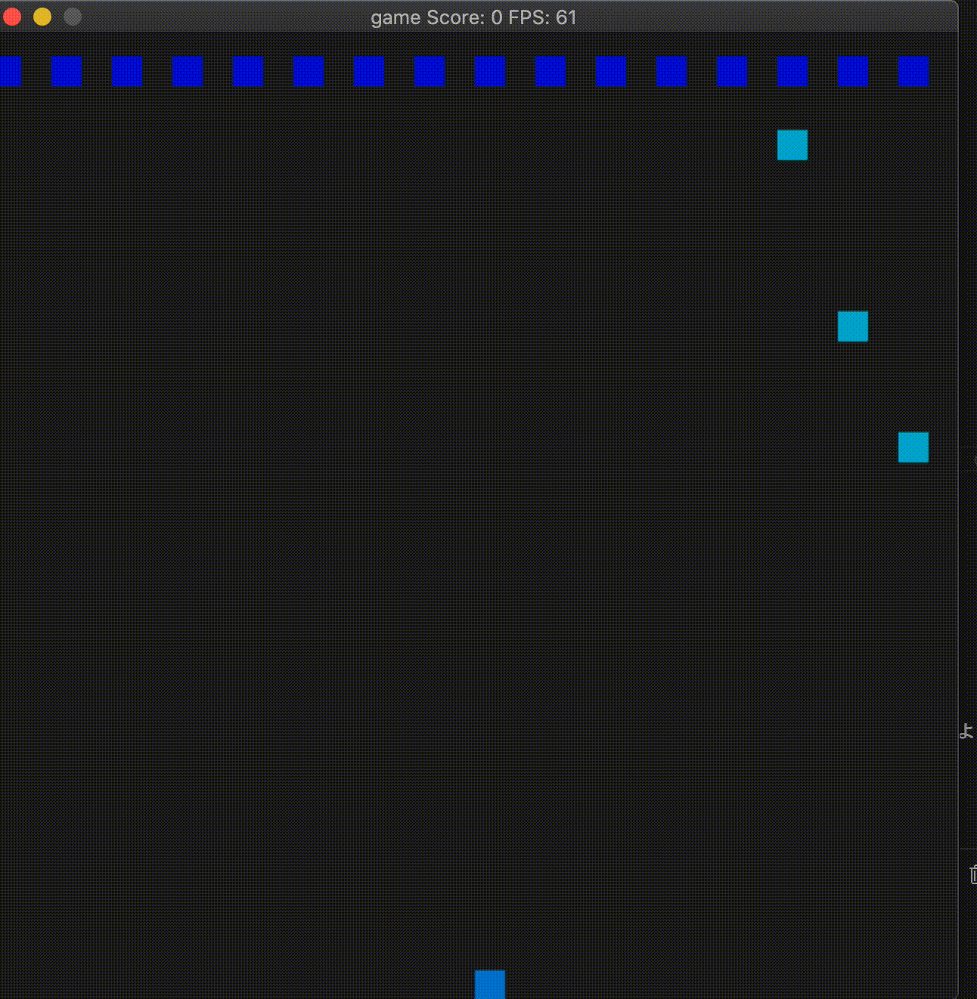

# Simple invador game



## Dependencies for Running Locally
* cmake >= 3.19.4
  * All OSes: [click here for installation instructions](https://cmake.org/install/)
* make >= 3.81 (Mac)
  * Mac: [install Xcode command line tools to get make](https://developer.apple.com/xcode/features/)
* gcc/g++ >= 5.4
  * Mac: - [install Xcode command line tools](https://developer.apple.com/xcode/features/)
* SDL2 >= 2.0.14
  * The SDL2 2.0.14 source code can be found [here](https://www.libsdl.org/download-2.0.php)
* SDL2_ttf >= https://www.libsdl.org/projects/SDL_ttf/
  1. download sdl_ttf
  2. Unzip the zip file
  3. ./configure
  4. make
  5. make install

## Basic Build Instructions

1. Clone this repo.
2. Make a build directory in the top level directory: `mkdir build && cd build`
3. Compile: `cmake .. && make`
4. Run it: `./Capstone`.

## Project description
This is a simple invader game.
The function is
- player can move left and right.
- player can shoot missiles.
- Enemy shoots missiles.
- The score is displayed.

## file tree

```sh
.
├── CMakeLists.txt
├── README.md
├── build
├── include
│   └── defs.h
└── src
    ├── Collision.cpp
    ├── Collision.h
    ├── Enemy.cpp
    ├── Enemy.h
    ├── Missile.cpp
    ├── Missile.h
    ├── Player.cpp
    ├── Player.h
    ├── Score.cpp
    ├── Score.h
    ├── controller.cpp
    ├── controller.h
    ├── game.cpp
    ├── game.h
    ├── main.cpp
    ├── renderer.cpp
    ├── renderer.h
    └── verdana.ttf // font file
```


- cmakeにsdlはあるがsdl_imageはないのでセット
- includeはヘッダーファイルをセット うまく動かないから却下
- 初期ループは既存のやつを参考にする
- prac_sdlをそれぞれ要素の分解してheaderとかつくって同じように動くようにする
- 初回配置場所変更
- 敵をドットで出現
- 敵を移動
- 自機が小さいドットを発射できる
- 当たり判定導入
- スコア導入
- 当たり判定 http://lazyfoo.net/tutorials/SDL/27_collision_detection/index.php
